# 🚀 SaaS Suporte de TI: Central de Atendimento Inteligente

Este ecossistema foi desenvolvido para **centralizar o suporte de TI em um único lugar**, eliminando o fluxo caótico de mensagens privadas enviadas diretamente aos técnicos. A solução une o **WhatsApp** com o poder da **Inteligência Artificial** e a eficiência de uma **Dashboard** moderna.

---

## 🎯 Objetivo do Sistema

O foco principal é a **produtividade e a organização**. Ao centralizar as demandas:
1.  **Fim das interrupções:** Técnicos não recebem mais chamados via chat privado.
2.  **Triagem Autônoma:** O chatbot atua como Nível 1, resolvendo problemas comuns via **RAG** sem intervenção humana.
3.  **Escalonamento Inteligente:** Se a IA não resolver, o chamado é aberto e enviado para a Dashboard.

---

## 🏗️ Como o Sistema Funciona (IA-First)

1.  **Entrada:** O usuário descreve o problema via WhatsApp (**Evolution API**).
2.  **Triagem:** O sistema transcreve áudios e analisa imagens de erro (Prints).
3.  **Resolução Autônoma:** O chatbot consulta a base de conhecimento no **Supabase** e tenta resolver via **RAG**.
4.  **Abertura de Chamado:** Caso o problema persista, o bot gera um ticket estruturado.
5.  **Gestão:** O técnico assume o chamado via **Dashboard Kanban**.

---

## 🤖 Parte 1: Arquitetura do Chatbot (n8n)

O chatbot foi construído com uma arquitetura de microsserviços, dividido em **7 workflows integrados** para garantir modularidade e alta performance.

### 1. Workflow Principal (Maestro)
É o núcleo do sistema. Ele gerencia a jornada do usuário, controla os tempos de espera e utiliza uma **Máquina de Estados** para gerenciar o contexto do atendimento.
> 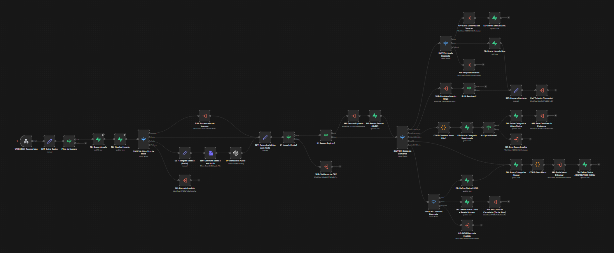

### 2. Validação de CPF (com Fast-Pass)
Módulo de segurança e identificação. Possui uma lógica de **Fast-Pass**: se o sistema identificar que o usuário já foi validado anteriormente e possui um cadastro ativo, ele pula a solicitação de dados, agilizando o início do suporte.
> 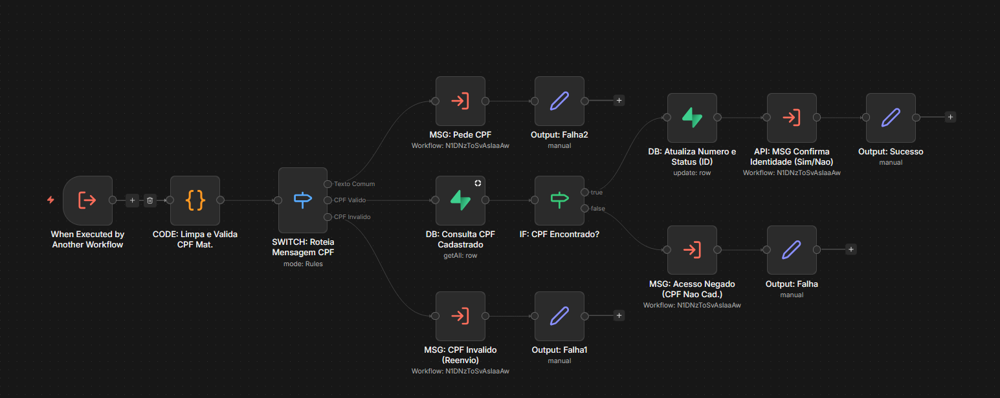

### 3. Processador de Imagem
Utiliza modelos de **Visão Computacional da OpenAI** para analisar capturas de tela. Ele identifica códigos de erro e descrições técnicas de imagens, anexando essas informações ao chamado.
> 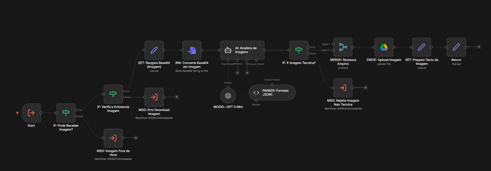

### 4. Pré-Atendimento (RAG com Agregação)
Este é o motor de inteligência. O workflow **junta e sintetiza todas as mensagens** enviadas pelo usuário para que a IA tenha o contexto completo. Então, realiza uma busca semântica na base de dados vetorial para tentar resolver o problema automaticamente.
> 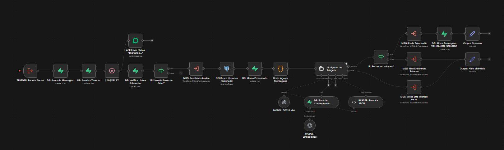

### 5. Criando Chamados
Consolida o histórico, o resumo da IA e a causa provável, formatando os dados e persistindo o ticket oficial no banco de dados **Supabase**.
> 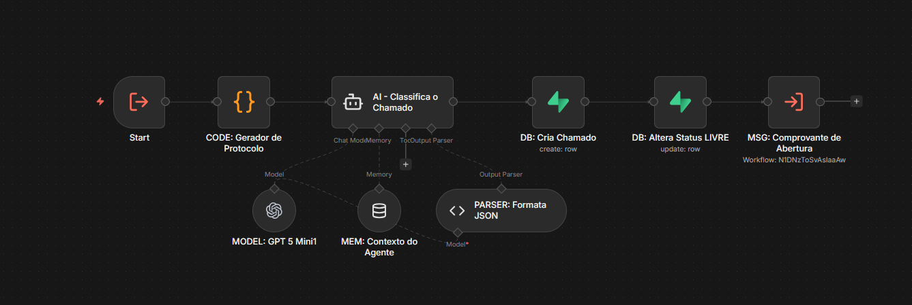

### 6. API - Enviar Mensagem
Ponto único de saída para todas as mensagens do bot. Centraliza as requisições para a **Evolution API**, facilitando manutenções futuras na integração com o WhatsApp.
> 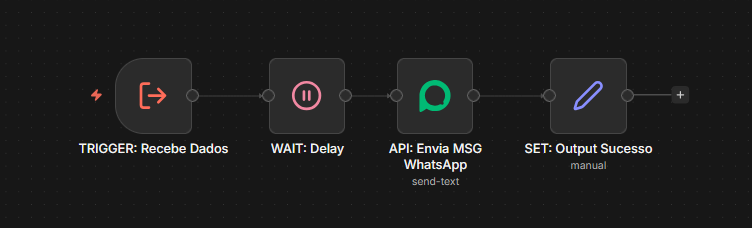

### 7. Alimentação da IA (RAG)
Workflow de backoffice para processamento de manuais e documentos. Realiza o tratamento do texto e gera os *embeddings* que permitem à IA aprender com novos conteúdos.
> 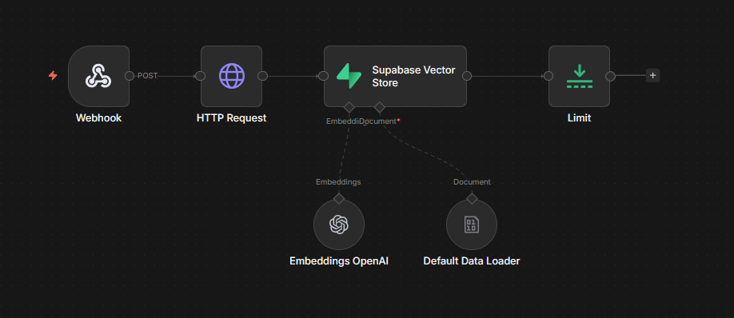

---

## 💻 Parte 2: Dashboard Administrativa (Lovable + React)

Interface desenvolvida para controle total do ecossistema, permitindo gestão de tickets, usuários autorizados e relatórios de performance.

### 🔐 1. Tela de Login
Acesso restrito e seguro para os membros da equipe técnica de TI.
> 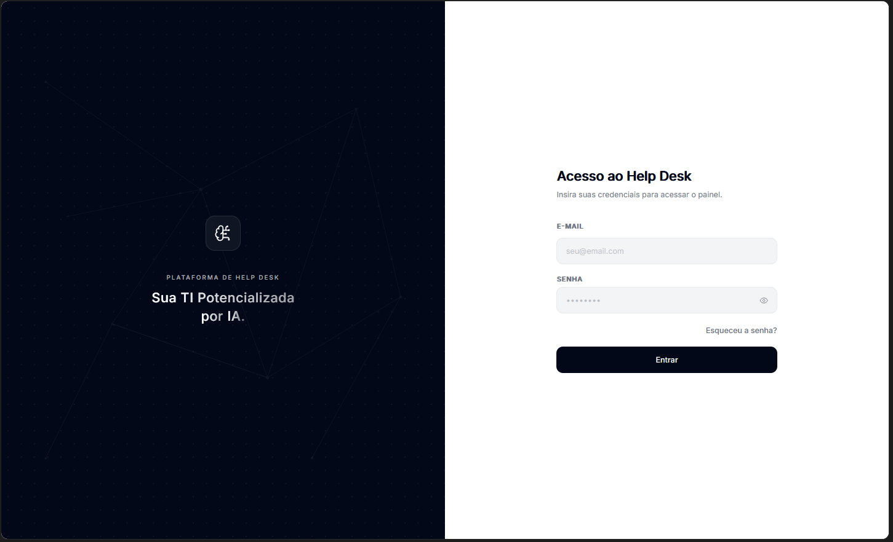

### 📋 2. Dashboard (Kanban)
Gestão visual dos tickets com suporte a drag-and-drop e visualização de prioridades.
> 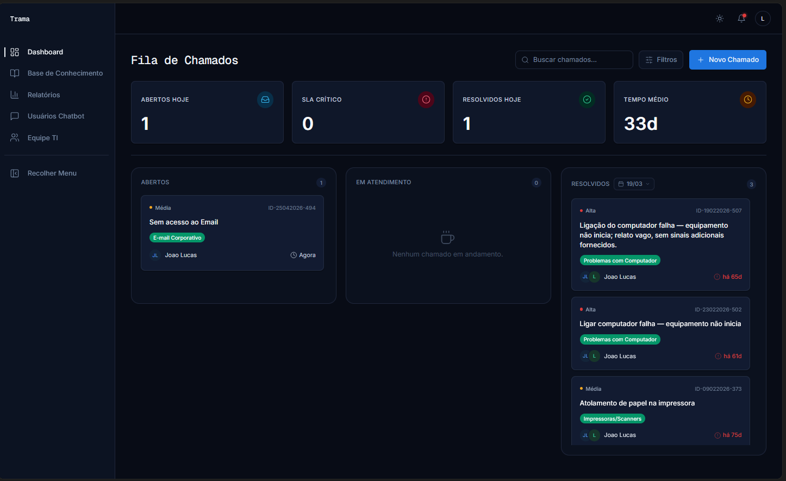

### 📚 3. Base de Conhecimento
Central de documentos onde a equipe de TI faz o upload de manuais que alimentam o cérebro da IA.
> 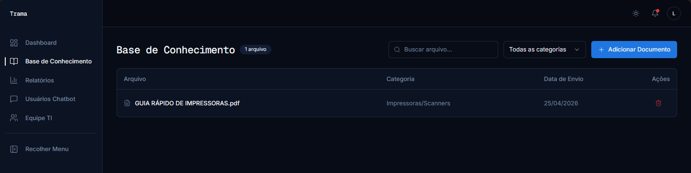

### 📊 4. Relatórios e Métricas
Análise de dados sobre o volume de chamados, tempo de resposta e taxa de resolução por IA.
> 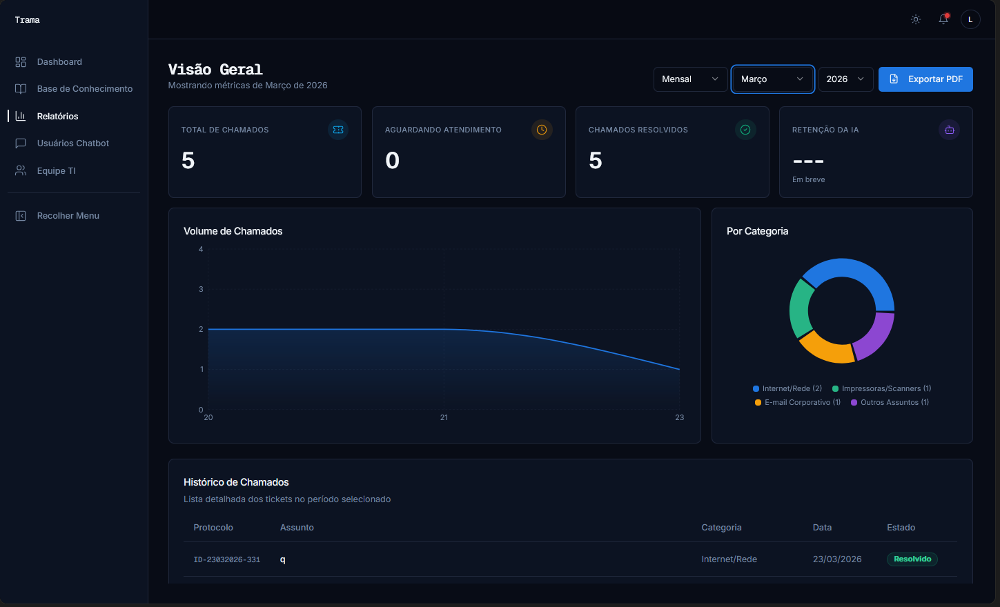

### 🛠️ 5. Equipe de TI
Gestão de membros e permissões dos técnicos que operam o sistema.
> 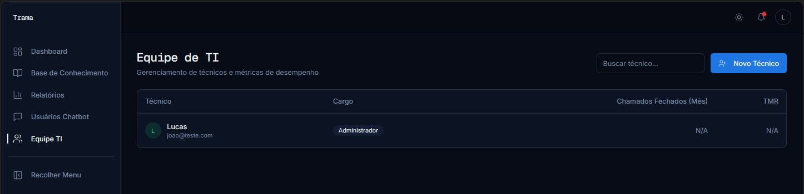

### 👥 6. Usuários Autorizados
Listagem e controle de todos os **usuários cadastrados que possuem permissão** para abrir chamados via chatbot. É aqui que se gerencia quem tem acesso ao suporte.
> 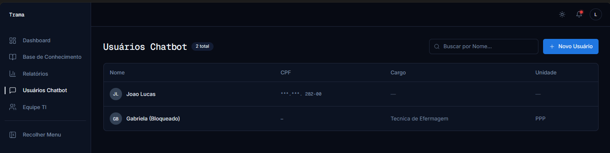

---

## 🛠️ Tech Stack

| Componente | Tecnologia |
| :--- | :--- |
| **Automação** | n8n |
| **WhatsApp** | Evolution API |
| **Banco de Dados** | Supabase (PostgreSQL + Vector) |
| **Frontend** | React + Vite (via **Lovable**) |
| **UI/UX** | Tailwind CSS + shadcn/ui |
| **Modelos IA** | OpenAI (GPT-4o / Text-Embedding-3) |

---

Desenvolvido por João Lucas Guimarães
